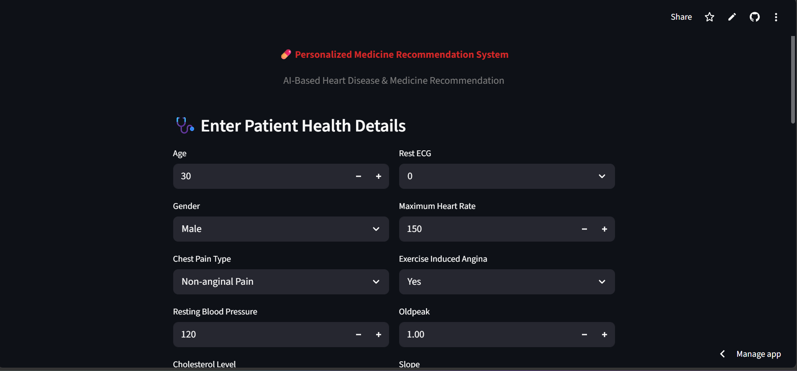
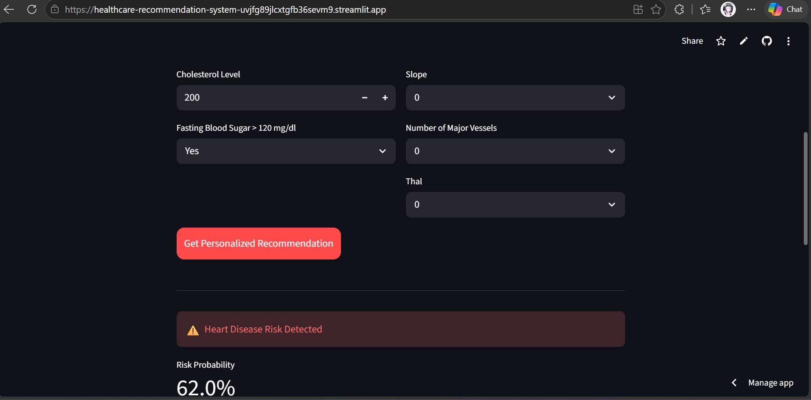
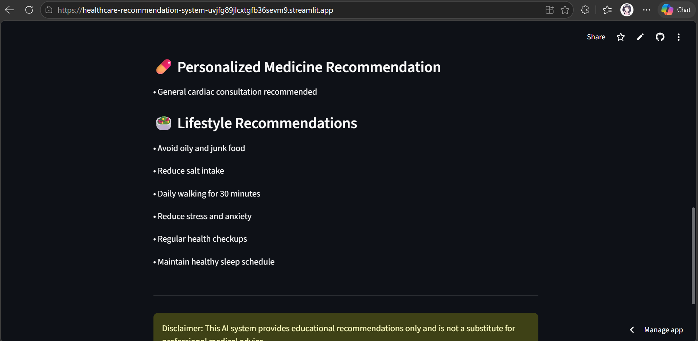

# ❤️ Personalized Medicine Recommendation System

An AI-powered healthcare application that predicts heart disease risk and provides personalized medicine and lifestyle recommendations using Machine Learning.

---

## 🚀 Live Demo

🔗 [Click Here to Open App](https://healthcare-recommendation-system-uvjfg89jlcxtgfb36sevm9.streamlit.app/)

---

## 📌 Features

- Heart Disease Prediction
- Risk Probability Detection
- Personalized Medicine Recommendation
- Lifestyle & Health Suggestions
- Interactive Streamlit UI
- Machine Learning-based Analysis

---

## 🛠️ Technologies Used

- Python
- Streamlit
- Scikit-learn
- Pandas
- NumPy
- Matplotlib
- Seaborn

---

## 📷 Screenshots

### 🏠 Home Page



---

### 📊 Prediction Result



---

### 💊 Medicine Recommendation



---

## ▶️ Run Locally

```bash
pip install -r requirements.txt
python -m streamlit run app.py
```

---

## ⚠️ Disclaimer

This system is developed for educational purposes only and should not be considered a replacement for professional medical advice.